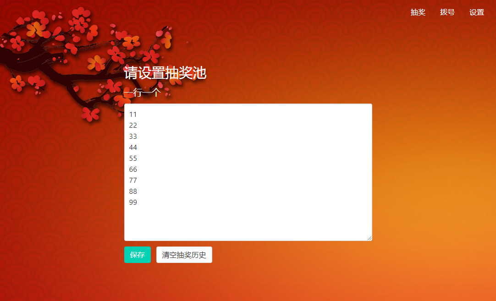
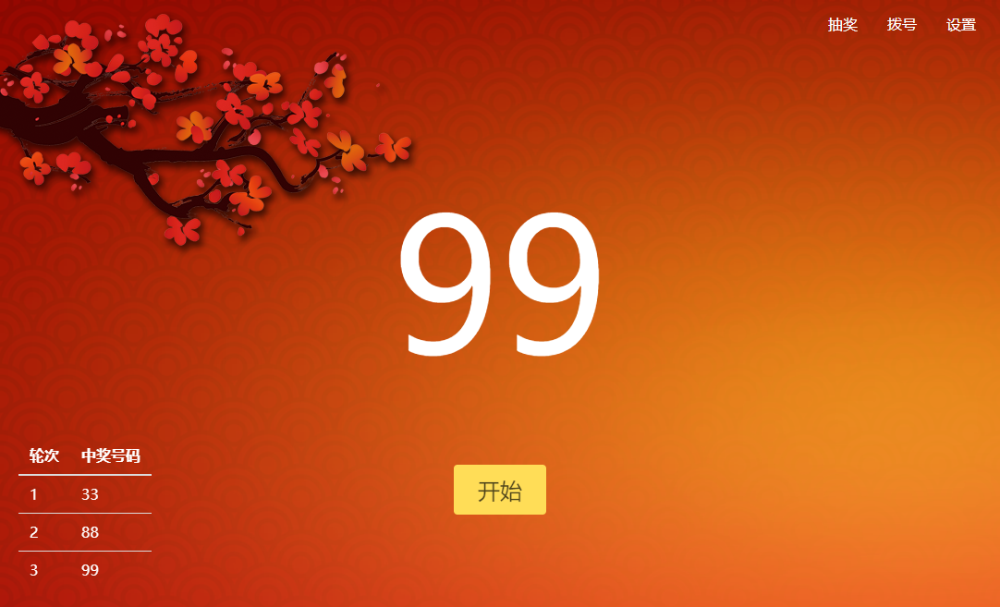

# Vue 实现的非常简单的抽奖页面

1. 可记忆抽奖历史, 记录在浏览器 local storage
2. 设置好抽奖池后, 一次抽1个, 同一个不会重复中奖

## Preview





## Live preview
http://lottery.imaegoo.com/

## Dependency
1. Vue.js
2. Bulma

## Project setup
```
npm install
```

### Compiles and hot-reloads for development
```
npm run serve
```

### Compiles and minifies for production
```
npm run build
```

### Lints and fixes files
```
npm run lint
```

### Customize configuration
See [Configuration Reference](https://cli.vuejs.org/config/).
